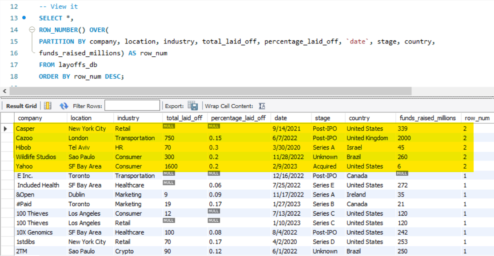
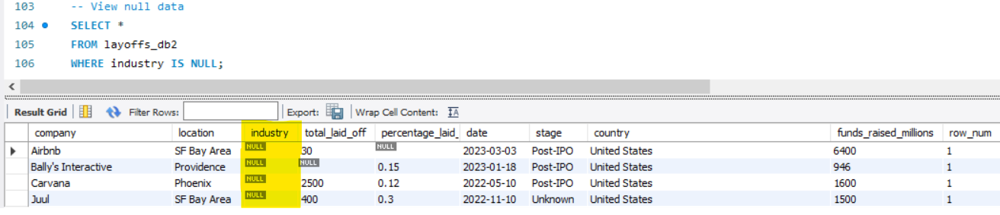
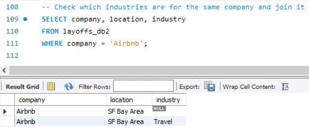
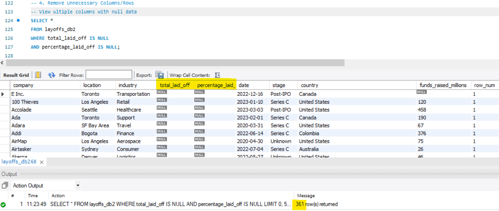

<h1 align="center">
    MySQL- Data Cleaning
     
    

   Layoffs Dataset
</h1>
<h3>Case Study: Data Cleaning and Preparation for Layoffs Dataset</h3>
<h4>Introduction</h4>

The layoffs dataset required extensive cleaning and preparation to ensure data integrity and consistency for further analysis. The SQL script provided outlines the steps taken to duplicate the dataset, remove duplicates, standardize data, handle null values, and eliminate unnecessary columns or rows. This case study explores the rationale, execution, and outcomes of these steps.

<h4>0. Duplicating the Dataset</h4>

To prevent accidental alterations to the original dataset, a duplicate table layoffs_db was created. This best practice ensures that the original data remains intact and available for reference or rollback if required.

 
  
<h4>1. Removing Duplicate Rows</h4>

Duplicate rows were identified and removed using the following process:

<ol>
  <li>Identification of Duplicates</li>
  
  <li>Removal of Duplicates</li>
</ol>

The dataset now contains unique entries, reducing redundancy and potential biases in analysis

  
<h4>2. Standardizing Data</h4>

<ol>
  <li>Trimming Whitespace</li>
  
A stored procedure was used to identify and clean leading or trailing spaces for attribute <b>company</b>

  
  <li>Renaming Similar Data</li>
  
Standardization was applied to harmonize data values:

  <ul>
    <li>Industries like "Crypto..." were renamed to "Crypto"</li>
    
    <li>Country names such as "United States..." were trimmed of extraneous periods or spaces.</li>
    
  </ul>
  <li>Formatting Dates</li>
  
The date column was converted from text to a standard DATE format using STR_TO_DATE() and further validated with a schema update.

</ol>

The data is now consistent, readable, and ready for aggregation or analysis

  
<h4>3. Handling Null and Blank Values</h4>

<ol>
  <li>Replacing Blank Values</li>
  
Blank values in the industry column were replaced with NULL to better represent missing data.

  <li>Filling Missing Data</li>
  
  
Missing industry values were inferred and filled based on matching company and location values when available.

  
</ol>

  
<h4>4. Removing rows with excessive nulls and removing unnecessary columns</h4>

Rows where total_laid_off and percentage_laid_off were both NULL were deleted as they provided no actionable information.

  
<h3>Conclusion</h3>

This cleaning process transforms the layoffs dataset into a reliable resource for analysis. By addressing issues like duplicates, inconsistent formatting, and missing data, the dataset now aligns with best practices for data quality. Future analyses can confidently leverage this refined dataset to uncover trends, correlations, and actionable insights regarding layoffs across industries and regions.

